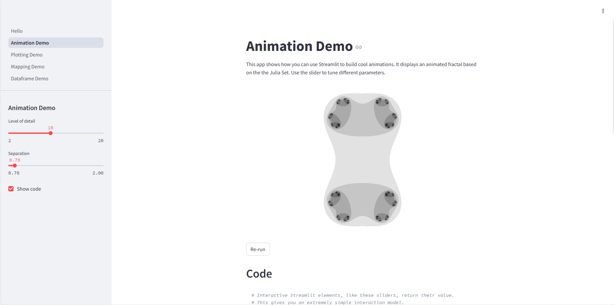

# 01 安装与配置

### 安装streamlit

> 建议使用conda创建虚拟环境用于学习
> 
> #### 安装conda
> 
> 前往https://www.anaconda.com/download ，选择与你操作系统（Windows, Mac 或 Linux）对应的 conda 版本
> 
> 下载安装器并运行，完成 conda 的安装
>
> ##### 新建环境
>
> 使用以下指令创建名为demo_env的虚拟环境，指定python版本为3.10
>
> ```bash
> conda create -n demo_env python==3.10 -y
>```
>
> ##### 激活虚拟环境
> ```bash
> conda activate demo_env
> # 注意，学习时需在demo_env环境中进行，退出环境 `conda deactivate`
> ```
> 激活后安装 streamlit

在终端或命令行中使用pip包管理器安装 streamlit

```
pip install streamlit
```

### 配置streamlit

某些情况下需要配置 streamlit，配置文件位置是~/.streamlit/config.toml(windows系统为：C:Users\Administrator\.streamlit),如果没有这个文件可以自行创建一个。

config.toml 示例：

```bash
[server]
port = 8501
enableCORS = false
 
[browser]
serverAddress = "localhost"
gatherUsageStats = false
 
[runner]
magicEnabled = false
```

注意：在config.toml文件中，大小写是敏感的，确保配置文件中的各个部分和参数名的大小写一致。

参数：

1、port：Streamlit应用的端口号，默认为 8501。

2、enableCORS：是否启用跨域资源共享，默认为false。如果需要开放Streamlit应用，在非本机电脑也行访问，则需要设置为true。

3、serverAddress：Streamlit服务器的地址，默认为 "localhost"。

4、gatherUsageStats参数默认是true，表示允许streamlit收集使用统计信息。一般禁用就行。

5、magicEnabled参数的默认值是true，表示启用Streamlit的魔法命令功能。即：任何时候如果Streamlit看到一个变量或常量值， 它就会自动将其使用st.write写入应用。所以可能容易导致网页速度变慢、重复加载数据等等情况。

命令行查看streamlit配置信息：

```
streamlit config show
```

### 启动示例 streamlit 应用

使用如下指令启动streamlit应用：

```bash
streamlit hello

# 执行自己编写的py文件使用命令 streamlit run your_app.py 即可。
```

运行上述命令后默认浏览器会自动跳转streamlit应用。


